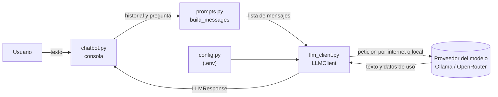

# Actividad 01: Chatbot con LLM

Primera versión del Asistente Inteligente del Curso de IA. En esta versión el usuario escribe una pregunta en
la consola y el programa se la envía directamente a un modelo de lenguaje (LLM) por medio de una API.

El objetivo de la práctica fue usar el modelo como una pieza más de un programa: enviarle mensajes, controlar
cómo responde con algunos parámetros, mantener al proveedor separado del resto del código y convertir su
respuesta en datos que el programa pueda revisar. En la unidad anterior se estudió cómo funciona un
Transformer por dentro; aquí el modelo se usó como una caja cerrada a la que se le hacen peticiones, y el
trabajo se enfocó en el programa que lo rodea.

El proceso completo, las pruebas y las respuestas a las preguntas de análisis están en el
[informe](../../INFORME.md). El enunciado original del profesor está en su repositorio,
[ProfOmarPinzon/ai-systems-lab-students](https://github.com/ProfOmarPinzon/ai-systems-lab-students).

## Cómo está organizado

| Archivo | Qué hace |
|---|---|
| `config.py` | Lee el archivo `.env` y reúne la configuración: proveedor, clave, modelo y parámetros |
| `llm_client.py` | Es la única parte que se comunica con el proveedor. Envía los mensajes y devuelve un `LLMResponse` |
| `prompts.py` | Guarda el prompt de sistema y arma la lista de mensajes que recibe el modelo |
| `chatbot.py` | Maneja la conversación en la consola y guarda el historial |
| `structured.py` | Le pide al modelo una respuesta en JSON y la valida con Pydantic |
| `fake_llm_client.py` | Cliente falso del reto opcional, para probar sin internet |
| `test_fake_provider.py` | Pruebas del reto opcional con `pytest` |

Solo `llm_client.py` usa la librería `openai`. Gracias a eso se pudo pasar de un modelo local (Ollama) a
OpenRouter cambiando solo el archivo `.env`.

## Lo que se hizo en cada paso

1. **Primera llamada al modelo (TODO 1 y 2).** Se completó `LLMClient.chat`, que arma la petición y convierte la respuesta en un `LLMResponse` con el texto, el modelo, el motivo de fin (`finish_reason`) y los tokens usados.
2. **Construcción de los mensajes (TODO 3).** `build_messages` arma la lista en este orden: mensaje de sistema, historial y pregunta nueva.
3. **Prompt de sistema (TODO 4).** Primero se probó el prompt genérico "Eres un asistente útil." y después se escribió uno que define el rol, el idioma, el nivel de los estudiantes y la regla de no inventar información del curso.
4. **Historial (TODO 5).** Sin el historial, el chatbot no recordaba la pregunta anterior. Con el historial sí, y se vio cómo aumentaban los tokens de entrada en cada turno.
5. **Parámetros del modelo.** Se probaron temperaturas de 0, 0.7 y 1.2, y límites de 30, 100 y 512 tokens, cambiando solo el `.env`.
6. **Respuesta estructurada (TODO 6).** El texto del modelo se revisa en dos pasos: primero que sea JSON y después que tenga los campos correctos.
7. **Cambio de proveedor.** Se pasó de Ollama (`qwen3:8b`) a OpenRouter (`nex-agi/nex-n2.5-pro:free`) sin cambiar ningún archivo `.py`.

## Resultado de las pruebas

| # | Prueba | Resultado esperado | Resultado obtenido |
|---|---|---|---|
| 1 | Llamada básica | `LLMResponse` con `finish_reason='stop'` y tokens mayores que cero | Cumple: `stop`, 39 tokens de entrada y 41 de salida |
| 2 | Rol system | El asistente no inventa la fecha del parcial | Cumple: dice que no tiene la información y remite al programa del curso o al profesor |
| 3 | Historial | La segunda respuesta sigue el tema; después de `/reiniciar` ya no hay contexto | Cumple: los tokens de entrada subieron de 314 a 535 y volvieron a 313 al reiniciar |
| 4 | Límite de tokens | Con 30 tokens la respuesta se corta con `finish_reason=length` | Cumple: se cortó a mitad de frase con `length` |
| 5 | Respuesta estructurada, tema general | JSON validado con `requiere_documentos_del_curso: false` | Cumple |
| 6 | Respuesta estructurada, tema del curso | JSON validado con `requiere_documentos_del_curso: true` | Cumple |
| 7 | Configuración ausente | Mensaje claro cuando falta la clave | Cumple: "Falta LLM_API_KEY..." sin error de la librería |
| 8 | Cambio de proveedor | El chatbot funciona sin modificar el código | Cumple: Ollama y OpenRouter con el mismo commit, cambiando solo el `.env` |

Las salidas completas están en la carpeta [evidencias](../../evidencias/).

## Reto opcional

Se hizo el reto del proveedor falso. `FakeLLMClient` tiene el mismo método `chat` que el cliente real, pero
devuelve respuestas fijas, y se activa con `LLM_PROVIDER=fake`. Con él se escribieron 8 pruebas que revisan
`build_messages` y `analyze_question`, incluidos los casos de un texto que no es JSON y de un JSON con un
valor no permitido. Las 8 pasan sin internet y sin clave.
